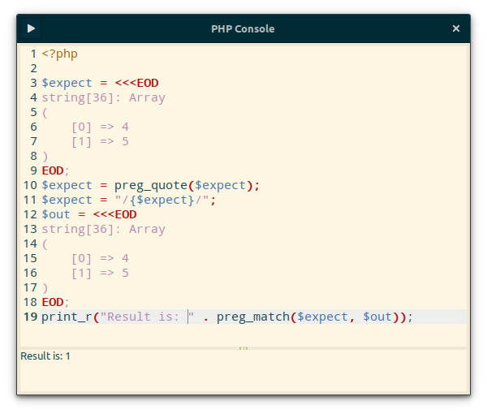

# PHP Console

A tiny Python3 application using GTK3, which allow you to simply
execute a PHP script without saving it. It's useful when you want to quickly
test a multi-line code snippet. It's in a way fancy version of `php -a`.

Right now only one command is available (`F5`) which will execute the code.

The code will be saved to `/tmp` and when you open the application next time,
it will load your previous code. But since this is `/tmp` code will not survive
reboots, so don't rely on it.

## Future plans

... if I won't be too lazy or too busy:

- change location to which code is being saved,
- turn it to proper application (organize rename files, make icon, etc..),
- make it available on AUR,
- allow code to be executed as you type,
- remember position and size,
- better shortcuts (CTRL+Q to exit, CTRL+Enter to execute code)
- offer some options, like:
    - font family, font size,
    - color scheme for syntax highlighting,
    - tab width,
    - location where code is being saved,
    - PHP location and parameters
- allow multiple tabs
